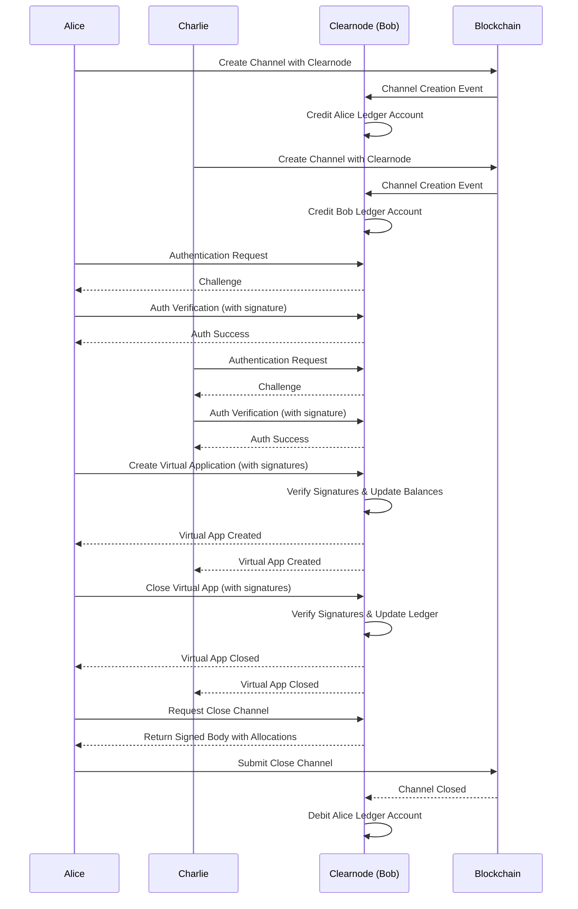

Nitrolite: State Channel Framework
Nitrolite is a lightweight, efficient state channel framework for Ethereum and other EVM-compatible blockchains, enabling off-chain interactions while maintaining on-chain security guarantees.

Overview
Nitrolite is a complete state channel infrastructure consisting of three main components:

Smart Contracts: On-chain infrastructure for state channel management
Clearnode: A broker providing ledger services for the Clearnet protocol
TypeScript SDK: Client-side library for building custom state channel applications
Key Benefits
Instant Finality: Transactions settle immediately between parties
Reduced Gas Costs: Most interactions happen off-chain, with minimal on-chain footprint
High Throughput: Support for thousands of transactions per second
Security Guarantees: Same security as on-chain, with cryptographic proofs
Chain Agnostic: Works with any EVM-compatible blockchain
Project Structure
This repository contains:

/contract: Solidity smart contracts for the state channel framework
/clearnode: Message broker implementation for the Clearnet protocol
/sdk: TypeScript SDK for building applications with Nitrolite
/docs: Protocol specifications and documentation
/examples: Sample applications built with Nitrolite
Protocol
Nitrolite implements a state channel protocol that enables secure off-chain communication with minimal on-chain operations. The protocol includes:

Channel Creation: A funding protocol where participants lock assets in the custody contract
Off-Chain Updates: A mechanism for exchanging and signing state updates off-chain
Channel Closure: Multiple resolution paths including cooperative close and challenge-response
Checkpointing: The ability to record valid states on-chain without closing the channel
Reset Capability: Support for resizing allocations by closing and reopening channels
See the protocol specification for complete details.

Smart Contracts
The Nitrolite contract system provides:

Custody of ERC-20 tokens for each channel
Mutual close when participants agree on a final state
Challenge/response mechanism for unilateral finalization
Checkpointing for recording valid states without closing
Deployments
For the most up-to-date contract addresses on all supported networks, see the contract deployments directory.

Each network directory contains deployment information with timestamps and contract addresses.

Interface Structure
The core interfaces include:

IChannel: Main interface for channel creation, joining, closing, and dispute resolution
IAdjudicator: Interface for state validation contracts
IDeposit: Interface for token deposits and withdrawals
IComparable: Interface for determining the ordering between states
See the contract README for detailed contract documentation.

Clearnode
Clearnode is an implementation of a message broker node providing ledger services for the Clearnet protocol. It enables efficient off-chain payment channels with on-chain settlement capabilities.

Features
Multi-Chain Support: Connect to multiple EVM blockchains (Polygon, Celo, Base)
Off-Chain Payments: Efficient payment channels for high-throughput transactions
Virtual Applications: Create multi-participant applications
Message Forwarding: Bi-directional message routing between application participants
Flexible Database: Support for both PostgreSQL and SQLite
Prometheus Metrics: Built-in monitoring and telemetry
Quorum-Based Signatures: Support for multi-signature schemes with weight-based quorums
See the Clearnode Documentation for detailed documentation.

TypeScript SDK
The SDK provides a simple client interface that allows developers to create and manage channels with their own application logic.

Installation
npm install @erc7824/nitrolite
Quick Start
Check Quick Start Guide

See the SDK README for detailed SDK documentation.

Examples
The repository includes several example applications built with Nitrolite:

Snake Game
A multiplayer snake game that uses state channels for secure, off-chain gameplay payments:

Real-time multiplayer: WebSocket-based gameplay
State channel integration: Secure payments and state signing
Fair fund distribution: Based on game outcome
Learn more about Snake

Tic Tac Toe
A simple tic-tac-toe game demonstrating the fundamentals of state channels:

React frontend: Simple, clean UI
WebSocket backend: For game coordination
State channel integration: For secure payments
Learn more about Tic Tac Toe

Key Concepts
State Channels
A state channel is a relationship between participants that allows them to exchange state updates off-chain, with the blockchain serving as the ultimate arbiter in case of disputes.

+---------+                    +---------+
|         |   Off-chain state  |         |
| Alice   |  <-------------→   | Bob     |
|         |      updates       |         |
+---------+                    +---------+
     ↑                              ↑
     |      On-chain resolution     |
     +------------+  +---------------+
                  |  |
             +----+--+----+
             |            |
             | Blockchain |
             |            |
             +------------+
Channel Lifecycle
Creation: Creator constructs channel config, defines initial state with CHANOPEN magic number
Joining: Participants verify the channel and sign the same funding state
Active: Once fully funded, the channel transitions to active state for off-chain operation
Off-chain Updates: Participants exchange and sign state updates according to application logic
Resolution:
Cooperative Close: All parties sign a final state with CHANCLOSE magic number
Challenge-Response: Participant can post a state on-chain and initiate challenge period
Checkpoint: Record valid state on-chain without closing for future dispute resolution
Reset: Close and reopen a channel to resize allocations
Data Structures
Channel: Configuration with participants, adjudicator, challenge period, and nonce
State: Application data, asset allocations, and signatures
Allocation: Destination address, token, and amount for each participant
Status: Channel lifecycle stages (VOID, INITIAL, ACTIVE, DISPUTE, FINAL)
Quick Start with Docker Compose
Get started quickly with the local development environment using Docker Compose:

# Start the environment
docker-compose up -d

# This will:
# 1. Start a local Anvil blockchain on port 8545
# 2. Deploy the Custody, ERC20, and FlagAdjudicator contracts
# 3. Seed the database with test tokens information
# 4. Start the Clearnode service.

# To check the status:
docker-compose ps

# To view logs:
docker-compose logs -f clearnode

# To stop the environment:
docker-compose down
Development
# Install dependencies
npm install

# Build the SDK
cd sdk && npm run build

# Run tests
cd contract && forge test
cd sdk && npm test
Contributing
Contributions are welcome! Please feel free to submit a Pull Request.

License
This project is licensed under the MIT License - see the LICENSE file for details.


---

# Clearnode

Clearnode is an implementation of a message broker node providing ledger services for the Clearnet protocol, which enables efficient off-chain payment channels with on-chain settlement capabilities for fast payment channel applications. This system allows participants to conduct transactions without requiring on-chain operations for every exchange, significantly reducing transaction costs and improving efficiency.

## Features

- **Multi-Chain Support**: Connect to multiple EVM blockchains (Polygon, Celo, Base)
- **Off-Chain Payments**: Efficient payment channels for high-throughput transactions
- **Virtual Applications**: Create multi-participant applications
- **Message Forwarding**: Bi-directional message routing between application participants
- **Flexible Database**: Support for both PostgreSQL and SQLite
- **Prometheus Metrics**: Built-in monitoring and telemetry
- **Quorum-Based Signatures**: Support for multi-signature schemes with weight-based quorums

### Communication Protocol

- [Protocol Specification](docs/Clearnode.protocol.md): Describes the protocol architecture and message format
- [API Reference](docs/API.md): Detailed API endpoint documentation



## Authentication and security Policy

Each websocket connection must be authenticated by signing the Policy struct defined in nitrolite.
Main console scope is `console` and allows superuser access to clearnode administration.
Application must also connect to clearnode with limited scope permissions (`app.create`) to only `create_app_session`
for a specific application address, a maximum allocation limit and register and assign the participant session key
with an expiration date.

`create_app_session` must verify:

- Policy scope allow to create app
- Wallet in allocation match with policy wallet address
- The application address match with the policy value
- Allocation is within the permitted policy Allowance
- Participant address from policy is in the first value of app participant array

```solidity
struct Policy {
    string challenge; // Unique challenge identifier (UUID format)
    string scope; // Permission scope (e.g., "app.create", "ledger.readonly")
    address wallet; // Main wallet address authorizing the session
    address application; // Application public address
    address participant; // Delegated session key address
    uint256 expire; // Expiration timestamp
    Allowance[] allowances; // Array of asset allowances
}
```

Once authenticated, a JWT is return for session persistence:

```typescript
type JWTClaims struct {
 Scope       string      `json:"scope"`       // Permission scope (e.g., "app.create", "ledger.readonly")
 Wallet      string      `json:"wallet"`      // Main wallet address authorizing the session
 Participant string      `json:"participant"` // Delegated session key address
 Application string      `json:"application"` // Application public address
 Allowances  []Allowance `json:"allowance"`   // Array of asset allowances
 jwt.RegisteredClaims
}
```

## Go Documentation

### Package Structure

- **main.go**: Application entry point, service initialization
- **config.go**: Configuration loading and environment variable handling
- **auth.go**: Authentication challenge generation and verification
- **ws.go**: WebSocket connection and message handling
- **ledger.go**: Double-entry accounting and balance management
- **channel.go**: Payment channel state management
- **rpc.go**: RPC protocol implementation and message format
- **custody.go**: Blockchain integration for channel monitoring
- **eth_listener.go**: Ethereum event listeners for custody contracts
- **signer.go**: Cryptographic operations for message signing
- **handlers.go**: RPC method handlers and business logic
- **metrics.go**: Prometheus metrics collection

### Key Interfaces

#### Ledger Interface

The ledger system manages financial transactions between accounts using double-entry accounting principles:

## Environment Variables

Clearnode requires the following environment variables to be properly configured:

| Variable | Description | Required | Default |
|----------|-------------|----------|---------|
| `BROKER_PRIVATE_KEY` | Private key used for signing broker messages | Yes | - |
| `DATABASE_DRIVER` | Database driver to use (postgres/sqlite) | No | sqlite |
| `CLEARNODE_DATABASE_URL` | Database connection string | No | clearnode.db |
| `LOG_LEVEL` | Logging level (debug, info, warn, error) | No | info |
| `HTTP_PORT` | Port for the HTTP/WebSocket server | No | 8000 |
| `METRICS_PORT` | Port for Prometheus metrics | No | 4242 |
| `MSG_EXPIRY_TIME` | Time in seconds for message timestamp validation | No | 60 |
| `POLYGON_INFURA_URL` | Polygon RPC endpoint URL | At least one network required | - |
| `POLYGON_CUSTODY_CONTRACT_ADDRESS` | Polygon custody contract address | Required if using Polygon | - |
| `POLYGON_ADJUDICATOR_ADDRESS` | Polygon adjudicator contract address | Required if using Polygon | - |
| `POLYGON_BALANCE_CHECKER_ADDRESS` | Polygon balance checker contract address | Required if using Polygon | - |

Multiple networks can be added. For each supported network (POLYGON, ETH_SEPOLIA, CELO, BASE, WORLD_CHAIN, LOCALNET), you can specify the corresponding INFURA_URL, CUSTODY_CONTRACT_ADDRESS, ADJUDICATOR_ADDRESS, and BALANCE_CHECKER_ADDRESS environment variables.

## Running with Docker

### Quick Start

1. Set up environment variables:

```
BROKER_PRIVATE_KEY=your_private_key
DATABASE_DRIVER=postgres
CLEARNODE_DATABASE_URL=file:./dev.db 
POLYGON_INFURA_URL=https://polygon-mainnet.infura.io/v3/your_infura_key
POLYGON_CUSTODY_CONTRACT_ADDRESS=0xYourContractAddress
POLYGON_ADJUDICATOR_ADDRESS=0xYourAdjudicatorAddress
```

### Run locally

```go
go run .
```

### Build and Run the Docker Image

```bash
# Build the Docker image
docker build -t clearnode .

# Run the container
docker run -p 8000:8000 -p 4242:4242  -v ./.env:/.env clearnode
```
---
Nitrolite SDK
npm version License Documentation

A TypeScript SDK for building scalable blockchain applications using ERC-7824. The SDK provides a simple client interface that allows developers to create and manage channels with custom application logic.

📚 Documentation
Complete Documentation - Full Documentation
Features
Instant Finality: Transactions settle immediately between parties
Reduced Gas Costs: Most interactions happen off-chain, with minimal on-chain footprint
High Throughput: Support for thousands of transactions per second
Security Guarantees: Same security as on-chain, with cryptographic proofs
Framework Agnostic: Works with any JavaScript framework (Vue, Angular, React, etc.)
Installation
npm install @erc7824/nitrolite
Quick Start
Nitrolite is our official SDK for creating high-performance decentralized applications. It provides a comprehensive set of functions and types to establish WebSocket connections with ClearNode and manage application sessions.

Prerequisites
Before you begin working with Nitrolite, ensure that you have:

Node.js: Version 16 or later
Package Manager: npm, yarn, or pnpm
Development Environment:
For frontend: React, Vue, or similar framework
For backend: Node.js environment
Channel Setup: Create a channel from your account at apps.yellow.com
ClearNode WebSocket
ClearNode WebSocket URL: wss://clearnet.yellow.com/ws

Build with AI
We have generated a llms-full.txt file that converts all our documentation into a single markdown document following the https://llmstxt.org/ standard.

Complete Workflow

Next steps
Building applications with Nitrolite involves these key steps:

Channel Creation: Create a channel from your account at apps.yellow.com
ClearNode Connection: Establish WebSocket connection for off-chain messaging
Application Sessions: Create sessions to run specific applications
Session Closure: Properly close application sessions when finished
We recommend working through these guides in sequence to understand the complete application workflow. Each guide builds on concepts from previous sections.

Start with the Channel Creation guide to begin your journey with Nitrolite applications.

Documentation
For complete documentation, visit https://erc7824.org

Contributing
Contributions are welcome! Please feel free to submit a Pull Request.

License
This project is licensed under the MIT License - see the LICENSE file for details.

---


Nitrolite SDK Documentation
Auto-generated documentation with real usage examples

The Nitrolite SDK empowers developers to build high-performance, scalable web3 applications using state channels.

Quick Start
npm install @erc7824/nitrolite
import { custodyAbi, NitroliteClient } from '@erc7824/nitrolite';

// Initialize client with full type safety
const client = new NitroliteClient({ ...config });

// Deposit funds for state channels
await client.deposit(tokenAddress, amount);

// Create a state channel
const { channelId } = await client.createChannel({
    initialAllocationAmounts: [amount1, amount2],
});
Available Contracts
custody
Functions: 10
Events: 9
Errors: 18
View Details
Key Features
✅ Auto-generated Types - Always synchronized with contract changes ✅ Real Usage Examples - Extracted from actual codebase usage ✅ Business Context - Meaningful descriptions from JSDoc comments ✅ Type Safety - Full TypeScript support with autocomplete ✅ Zero Maintenance - Documentation updates automatically


---

# custody Contract

Complete reference for the custody smart contract with 11 functions, 9 events, and 18 custom errors.

## Functions

### `challenge`

Initiates a challenge against a state channel, disputing the current state with evidence of a more recent valid state.

**Type:** `nonpayable`

**Parameters:**

- **`channelId`**: Unique 32-byte identifier
- **`candidate`**: The proposed new state for the channel
- **`proofs`**: Supporting states that prove the transition is valid

**Example Usage:**

```typescript
// Execute challenge transaction
const { request } = await publicClient.simulateContract({
    address: contractAddress,
    abi: contractAbi,
    functionName: 'challenge',
    args: [channelId, candidate, proofs],
});

// Execute the transaction
const hash = await walletClient.writeContract(request);
```

### `checkpoint`

Updates the channel to a new agreed-upon state, typically used to progress the channel without disputes.

**Type:** `nonpayable`

**Parameters:**

- **`channelId`**: Unique 32-byte identifier
- **`candidate`**: The proposed new state for the channel
- **`proofs`**: Supporting states that prove the transition is valid

**Example Usage:**

```typescript
// Execute checkpoint transaction
const { request } = await publicClient.simulateContract({
    address: contractAddress,
    abi: contractAbi,
    functionName: 'checkpoint',
    args: [channelId, candidate, proofs],
});

// Execute the transaction
const hash = await walletClient.writeContract(request);
```

### `close`

contract Custody is IChannel, IDeposit {

**Type:** `nonpayable`

**Parameters:**

- **`channelId`**: Unique 32-byte identifier
- **`candidate`**: The proposed new state for the channel
- **``**: The token contract address (use address(0) for ETH)

**Example Usage:**

```typescript
// Execute close transaction
const { request } = await publicClient.simulateContract({
    address: contractAddress,
    abi: contractAbi,
    functionName: 'close',
    args: [channelId, candidate],
});

// Execute the transaction
const hash = await walletClient.writeContract(request);
```

### `create`

contract Custody is IChannel, IDeposit {

**Type:** `nonpayable`

**Parameters:**

- **`ch`**: Unique identifier for the state channel
- **`initial`**: The starting state when creating a new channel

**Returns:**

- **`channelId`** (`bytes32`): bytes32

**Example Usage:**

```typescript
// Execute create transaction
const { request } = await publicClient.simulateContract({
    address: contractAddress,
    abi: contractAbi,
    functionName: 'create',
    args: [ch, initial],
});

// Execute the transaction
const hash = await walletClient.writeContract(request);
```

### `deposit`

Deposits tokens or ETH into the custody contract for use in state channels.

**Type:** `payable`

**Parameters:**

- **`token`**: The token contract address (use address(0) for ETH)
- **`amount`**: Amount in the token's smallest unit (wei for ETH, etc.)

**Real Usage Examples:**

```typescript
// Log client methods for deposit
console.log('[depositToChannel] Available client methods:', Object.keys(client));

const amountBigInt =
    typeof amount === 'string' && !amount.startsWith('0x') ? parseTokenUnits(tokenAddress, amount) : BigInt(amount);
```

### `getAccountChannels`

contract Custody is IChannel, IDeposit {

**Type:** `view`

**Parameters:**

- **`account`**: Ethereum address to query information for

**Returns:**

- **``** (`bytes32[]`): bytes32[]

**Real Usage Examples:**

```typescript
}

    async getAccountChannels() {
        if (!this.client || !this.isConnected) {
            console.error("ClearNet client not initialized");
```

### `getAccountInfo`

contract Custody is IChannel, IDeposit {

**Type:** `view`

**Parameters:**

- **`user`**: Ethereum address of the user account
- **`token`**: The token contract address (use address(0) for ETH)

**Returns:**

- **`available`** (`uint256`): uint256
- **`channelCount`** (`uint256`): uint256

**Example Usage:**

```typescript
// Read getAccountInfo from contract
const result = await publicClient.readContract({
    address: contractAddress,
    abi: contractAbi,
    functionName: 'getAccountInfo',
    args: [user, token],
});
```

### `getContractInfo`

/ Newly added function to test type chain

**Type:** `pure`

**Parameters:**
None

**Returns:**

- **`version`** (`string`): string
- **`maxParticipants`** (`uint256`): uint256
- **`minChallengePeriod`** (`uint256`): uint256

**Example Usage:**

```typescript
// Read getContractInfo from contract
const result = await publicClient.readContract({
    address: contractAddress,
    abi: contractAbi,
    functionName: 'getContractInfo',
});
```

### `join`

contract Custody is IChannel, IDeposit {

**Type:** `nonpayable`

**Parameters:**

- **`channelId`**: Unique 32-byte identifier
- **`index`**: Numeric value (in smallest units)
- **`sig`**: tuple value

**Returns:**

- **``** (`bytes32`): bytes32

**Real Usage Examples:**

```typescript
console.error("Failed to hash state:", error);
            // Return a mock hash if there's an error
            return "0x" + Array(64).fill("0").join("") as Hex;
        }
    }
```

### `resize`

contract Custody is IChannel, IDeposit {

**Type:** `nonpayable`

**Parameters:**

- **`channelId`**: Unique 32-byte identifier
- **`candidate`**: The proposed new state for the channel
- **`proofs`**: Supporting states that prove the transition is valid

**Example Usage:**

```typescript
// Execute resize transaction
const { request } = await publicClient.simulateContract({
    address: contractAddress,
    abi: contractAbi,
    functionName: 'resize',
    args: [channelId, candidate, proofs],
});

// Execute the transaction
const hash = await walletClient.writeContract(request);
```

### `withdraw`

Withdraws available funds from the custody contract back to the user's wallet.

**Type:** `nonpayable`

**Parameters:**

- **`token`**: The token contract address (use address(0) for ETH)
- **`amount`**: Amount in the token's smallest unit (wei for ETH, etc.)

**Example Usage:**

```typescript
// Execute withdraw transaction
const { request } = await publicClient.simulateContract({
    address: contractAddress,
    abi: contractAbi,
    functionName: 'withdraw',
    args: [token, amount],
});

// Execute the transaction
const hash = await walletClient.writeContract(request);
```

## Events

### `Challenged`

**Parameters:**

- **`channelId`** (`bytes32`): bytes32
- **`expiration`** (`uint256`): uint256

### `Checkpointed`

**Parameters:**

- **`channelId`** (`bytes32`): bytes32

### `Closed`

**Parameters:**

- **`channelId`** (`bytes32`): bytes32
- **`finalState`** (`tuple (intent: uint8, version: uint256, data: bytes, allocations: tuple[], sigs: tuple[])`): struct State

### `Created`

**Parameters:**

- **`channelId`** (`bytes32`): bytes32
- **`wallet`** (`address`): address
- **`channel`** (`tuple (participants: address[], adjudicator: address, challenge: uint64, nonce: uint64)`): struct Channel
- **`initial`** (`tuple (intent: uint8, version: uint256, data: bytes, allocations: tuple[], sigs: tuple[])`): struct State

### `Deposited`

**Parameters:**

- **`wallet`** (`address`): address
- **`token`** (`address`): address
- **`amount`** (`uint256`): uint256

### `Joined`

**Parameters:**

- **`channelId`** (`bytes32`): bytes32
- **`index`** (`uint256`): uint256

### `Opened`

**Parameters:**

- **`channelId`** (`bytes32`): bytes32

### `Resized`

**Parameters:**

- **`channelId`** (`bytes32`): bytes32
- **`deltaAllocations`** (`int256[]`): int256[]

### `Withdrawn`

**Parameters:**

- **`wallet`** (`address`): address
- **`token`** (`address`): address
- **`amount`** (`uint256`): uint256

## Errors

### `ChallengeNotExpired`

### `ChannelNotFinal`

### `ChannelNotFound`

**Parameters:**

- **`channelId`** (`bytes32`): bytes32

### `ECDSAInvalidSignature`

### `ECDSAInvalidSignatureLength`

**Parameters:**

- **`length`** (`uint256`): uint256

### `ECDSAInvalidSignatureS`

**Parameters:**

- **`s`** (`bytes32`): bytes32

### `InsufficientBalance`

**Parameters:**

- **`available`** (`uint256`): uint256
- **`required`** (`uint256`): uint256

### `InvalidAdjudicator`

### `InvalidAllocations`

### `InvalidAmount`

### `InvalidChallengePeriod`

### `InvalidParticipant`

### `InvalidState`

### `InvalidStateSignatures`

### `InvalidStatus`

### `InvalidValue`

### `SafeERC20FailedOperation`

**Parameters:**

- **`token`** (`address`): address

### `TransferFailed`

**Parameters:**

- **`token`** (`address`): address
- **`to`** (`address`): address
- **`amount`** (`uint256`): uint256

## Type Safety

This contract is fully type-safe when used with the generated TypeScript types:

```typescript
import { custodyAbi } from '@erc7824/nitrolite';

// Full type safety with autocomplete
const result = await publicClient.readContract({
  address: contractAddress,
  abi: custodyAbi,
  functionName: 'functionName', // ✅ Autocomplete available
  args: [...], // ✅ Type-checked arguments
});
```